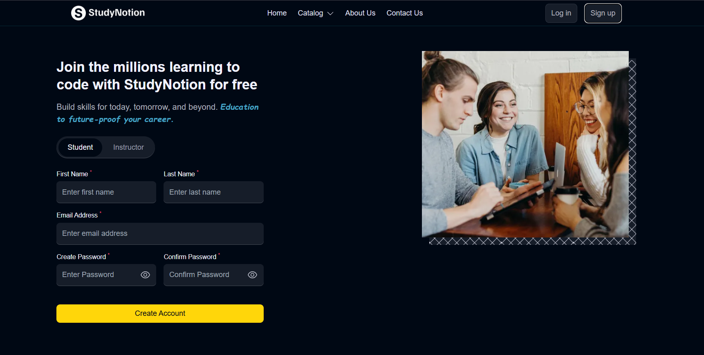
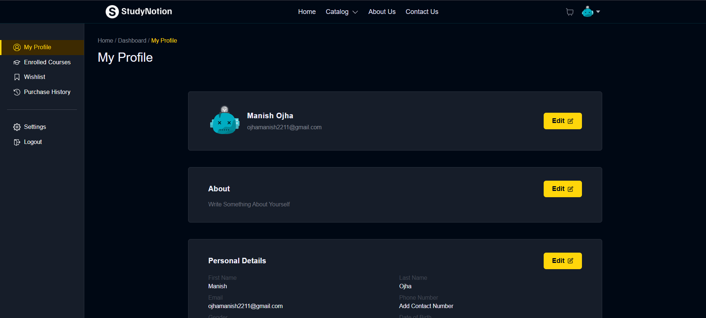

# 📚 StudyNotion – EdTech Platform (MERN Stack)

🔗 **Live Link:** https://studynotion-edu-mern.netlify.app/

---

## 🚀 About the Project

**StudyNotion** is a full-stack **EdTech platform** where:

- 👨‍🏫 Independent instructors can draft, create, and publish their courses.
- 👨‍🎓 Students can explore and enroll in courses by purchasing them.
- 💳 Secure online payments are handled through Razorpay.
- 📊 Users get personalized dashboards to manage learning or teaching activities.

The platform provides a modern, scalable, and production-ready learning management system built using the MERN stack.

---

# 🛠️ Tech Stack

## 🌐 Frontend

- React.js
- Redux Toolkit (State Management)
- React Router DOM
- Tailwind CSS
- Axios

## ⚙️ Backend

- Node.js
- Express.js
- MongoDB
- Mongoose
- JWT Authentication
- Cloudinary (Media Storage)

## 💳 Payment Integration

- Razorpay Payment Gateway

# ✨ Key Features

- Role-based Authentication (Student / Instructor)
- Course Creation & Management
- Secure Razorpay Payment Integration
- JWT-based Protected Routes
- Dashboard for Students & Instructors
- Cloudinary Media Upload

---

# 📸 Screenshots

## 🏠 Home Page


## 🧑‍💻 Signup Page



## 📊 Dashboard



---

## 🧩 Prerequisites

Make sure you have installed:

- Node.js (v18+ recommended)
- npm
- MongoDB (local or MongoDB Atlas)
- Razorpay account
- Cloudinary account

# ⚙️ Setup & Installation Guide

Follow these steps to run the project locally.

---

## 1️⃣ Clone the Repository

```bash
git clone https://github.com/mayankojha07/studynotion-edtech-app.git
cd studynotion-edtech-app
```

## 2️⃣ Install Dependencies

Install Backend Dependencies

```bash
cd server
npm install
```

Install Frontend Dependencies

```bash
npm install
```

## 🔑 Environment Variables Setup

Create a .env file inside the server folder.

📂 server/.env

```bash
PORT=4000
MONGODB_URL=your_mongodb_connection_string

JWT_SECRET=your_jwt_secret_key

CLOUD_NAME=your_cloudinary_name
API_KEY=your_cloudinary_api_key
API_SECRET=your_cloudinary_api_secret

RAZORPAY_KEY=your_razorpay_key
RAZORPAY_SECRET=your_razorpay_secret

MAIL_HOST=smtp.gmail.com
MAIL_USER=your_email
MAIL_PASS=your_email_password

FRONTEND_URL=http://localhost:3000
```

## 🖥️ Start Backend & Frontend Server (Concurrently)

```bash
npm run dev
```

## 📁 Project Structure

```bash
studynotion-edtech-app/
│
├── client/ # React Frontend
├── server/ # Node/Express Backend
├── screenshots/ # Project Images
└── README.md
```

# 👨‍💻 Author

- **Mayank Ojha**
- **GitHub:** https://github.com/mayankojha07
